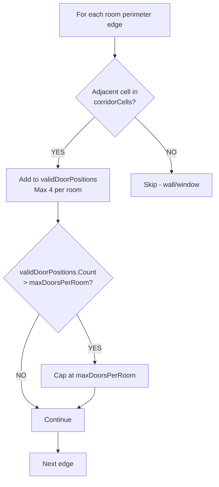

# 🏗️ OptimizedBuildingGenerator V2 - Architecture Diagram

```mermaid
graph TD
    A[GenerateRoomsOptimized] --> B[ConnectRoomsWithCorridors<br/>A* Paths → corridorCells HashSet]
    B --> C[BuildRoomBoundaryGraph<br/>RoomEdge[position, dir, touchesCorridor]]
    C --> D{Exterior Walls?}
    
    D -->|YES| E[PlaceExteriorWalls<br/>1 Entrance + Windows]
    D -->|NO | F[PlaceSmartInteriorDoors<br/>ONLY room → corridor edges]
    
    E --> G[PlaceFloorsOptimized]
    F --> G
    
    G --> H[PlaceRemainingWalls<br/>No doors/windows here]
    
    style A fill:#e1f5fe
    style B fill:#e1f5fe
    style C fill:#f3e5f5
    style D fill:#fff3e0
    style E fill:#e8f5e8
    style F fill:#e8f5e8
    style G fill:#fff8e1
    style H fill:#fff8e1

## Data Flow
    I[corridorCells<br/>HashSet<Vector2Int>] -.-> C
    J[validDoorPositions<br/>List<RoomEdge>] -.-> F
```

## Detailed RoomEdge Structure

```csharp
struct RoomEdge 
{
    Vector2Int position;      // Grid cell (x,y)
    string direction;         // north/south/east/west
    bool touchesCorridor;     // Key discriminator
    bool isExterior;          // Building perimeter
    RoomNode connectedRoom;   // Owning room
}
```

## Smart Door Placement Algorithm



## Execution Guarantees

```
✅ Exactly 1 door per room-corridor connection
✅ Max 4 doors per room (configurable)
✅ No intra-room doors
✅ No corridor-corridor doors  
✅ Maintains Object Pooling + Spatial Partitioning
✅ Backward compatible with v1 prefabs
```

## Migration Plan
```
1. Create OptimizedBuildingGeneratorV2.cs
2. Copy v1 prefabs/settings  
3. Replace Object in scene
4. Test in Unity 6000.2.12f1
5. Delete v1 script
```

**Ready for Code Implementation → Switch to Code Mode**